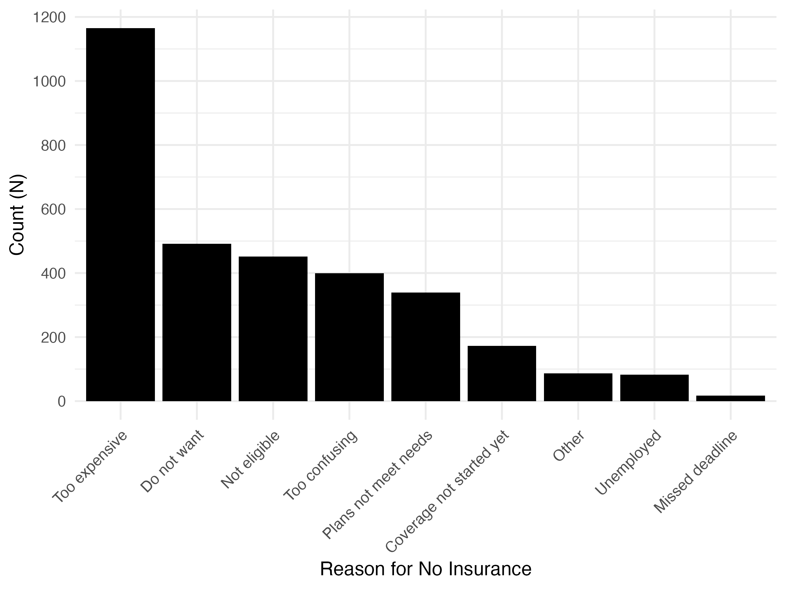
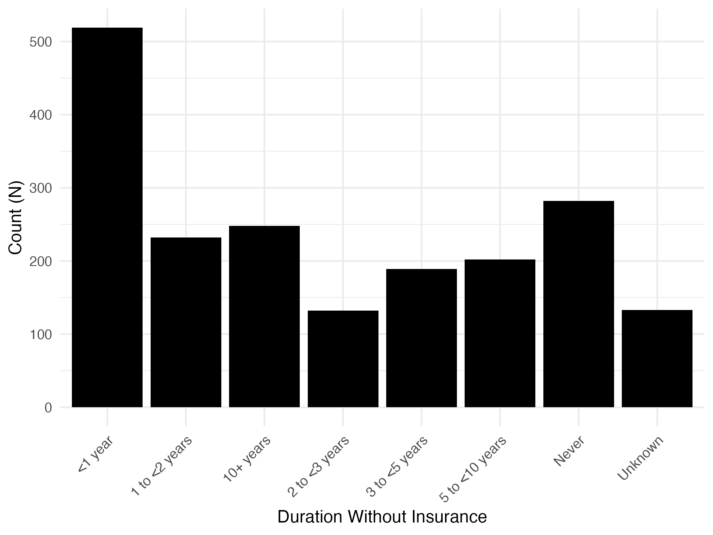

## Table 1

```{r, echo = F}
readRDS('../figures/table_1.rds')
```

## Table 2

```{r, echo = F}
readRDS('../figures/table_2.rds')
```

## Counts of Reasons for No Insurance



## Counts of Duration Without Insurance


